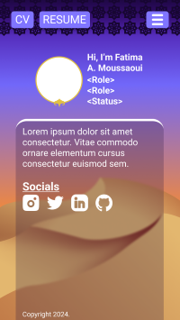

# fam-cs.github.io
A personal website where I attempt to document and showcase my experience learning about usability, CS, and design.
Built with React and Typescript.
This project is ongoing as I continue to learn.

## Project Screenshots
You can find the deployed site at [fam-cs.github.io](https://fam-cs.github.io/). Below are some initial designs in Figma and the progression (last two photos).

## Installation and Setup Instructions
You will need [node](https://nodejs.org/en) to build the project.
1. Clone the repository.
2. Install node packages: `npm install`
3. Run the app in developer mode (enables website to re-load): `npm run dev`
4. A link like http://localhost:5173/ should appear in the terminal to view the site.

For deploying to a website, I followed the instructions [here](https://dev.to/rashidshamloo/deploying-vite-react-app-to-github-pages-35hf).

## Reflection
Getting this project deployed has been an interesting lesson in defining what "done" means.
I faced challenges with making images fit different screen ratios, due to my earlier Figma designs, which caused this project to stagnate for a few months.
After discussing with others, I decided to create an MVP with a simpler design to move forward.

I've learned some new things for this project such as:
- how to use and make SVGs (and why they're awesome)
- how to deploy a React app to Github pages
- styling/auto-layout features in Figma

## Resources
- https://www.aleksandrhovhannisyan.com/blog/svg-tutorial/
- https://www.nngroup.com/articles/sticky-headers/
- https://dev.to/rashidshamloo/deploying-vite-react-app-to-github-pages-35hf
- https://gist.github.com/martensonbj/6bf2ec2ed55f5be723415ea73c4557c4
